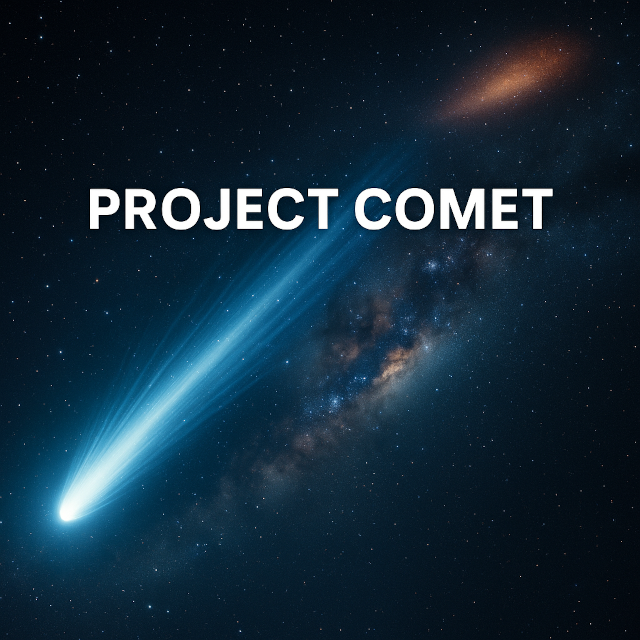

**Project Comet** is a reproducible analysis pipeline for studying the **cosmic microwave background (CMB)** and **CMB lensing** using Planck satellite data. The aim is to provide a modern, open, and automatable framework for exploring cosmological signals, validating theoretical models, and benchmarking analysis workflows.

This project integrates:
- **High-resolution Planck component maps** (SMICA CMB map and lensing convergence map).
- **NaMaster** for pseudo-$C_\ell$ estimation and cross-spectrum analysis.
- A modular **Python CLI** (`comet`) for configuration, running, and summarizing results.
- **Continuous integration** with scientific software dependencies pinned for reproducibility.


---

## Scientific Background

The **CMB** provides a snapshot of the universe at $z \sim 1100$, encoding both the primordial density fluctuations and later physical effects. Of particular interest:

- **CMB lensing**: Deflections of CMB photons by intervening large-scale structure. This remaps CMB anisotropies and encodes information about the matter distribution at $z \sim 2$.
- **Cross-correlations**: Combining CMB lensing with galaxy surveys or internal Planck products constrains cosmological parameters and tests $\Lambda$CDM.
- **Pseudo-$C_\ell$ techniques**: Estimation of angular power spectra in the presence of masks, implemented here via [NaMaster](https://namaster.readthedocs.io).

For background, see the references in the [docs](docs/) directory:
- Planck Collaboration (2018): *Planck 2018 results. VIII. Gravitational lensing*
- Alonso et al. (2019): *NaMaster: Master of the Mask*
- Other project-specific notes in `docs/*.pdf`.

---

## Features

- **Config-driven runs**: input data and pipeline steps specified via YAML (`config/prereg.yaml`, `config/paths.example.yaml`).
- **Automated data checks**: verifies presence and integrity of large Planck maps before processing.
- **Stable CLI interface**:
  ```bash
  ./bin/comet-run
  ```
  produces a JSON summary of run metadata and results.
- **Local + CI reproducibility**: identical environments with `micromamba`, verified via `./bin/ci`.
- **Extensible analysis**: current pipeline stubs compute metadata; next stage integrates NaMaster for $C_\ell$ estimation.

---

## Getting Started

### 1. Create environment
```bash
micromamba create -f environment.yml
micromamba run -n comet pip install -e ".[dev]"
```

### 2. Run tests & lint
```bash
./bin/ci
```

### 3. Stage the Planck maps

Download the Planck SMICA temperature and lensing convergence maps and place
them in the repository's `data/` directory:

```
project-comet/
└── data/
    ├── COM_CompMap_CMB-smica_2048_R1.20.fits
    └── COM_CompMap_Lensing_2048_R1.10.fits
```

If you keep the maps somewhere else, point the pipeline at that directory by
setting `COMET_DATA_DIR` before running the CLI:

```bash
export COMET_DATA_DIR=/path/to/planck/maps
```

You can confirm that the data are discoverable with the helper command:

```bash
micromamba run -n comet python -m comet.cli data --list
```

### 4. Run pipeline
```bash
./bin/comet-run
cat artifacts/summary.json
```

This will produce a JSON output like:
```json
{
  "ordering": "both",
  "results": {
    "nbins": 0,
    "z": 0.0,
    "notes": "stub"
  }
}
```

---

## Project Structure

```
project-comet/
├── bin/               # CLI wrappers (comet-run, ci)
├── config/            # Example preregistration + paths configs
├── data/              # Large Planck FITS maps (ignored by Git)
├── docs/              # Scientific documentation, PDFs, figures
├── src/comet/         # Python package (cli, run, io_maps, etc.)
├── tests/             # Unit and smoke tests
├── artifacts/         # Generated outputs (ignored by Git)
├── environment.yml    # Micromamba environment definition
├── Makefile           # Common commands (make ci, make run, make lint)
└── README.md          # You are here
```

---

## References

- [Planck 2018 lensing paper (A&A, 641, A8)](https://arxiv.org/abs/1807.06210)
- [NaMaster: Master of the Mask](https://arxiv.org/abs/1809.09603)
- Additional project design notes and figures: see [`docs/`](docs/).
